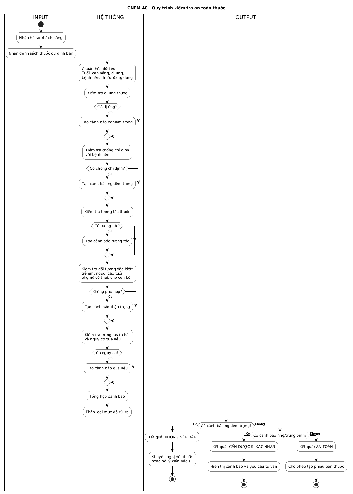
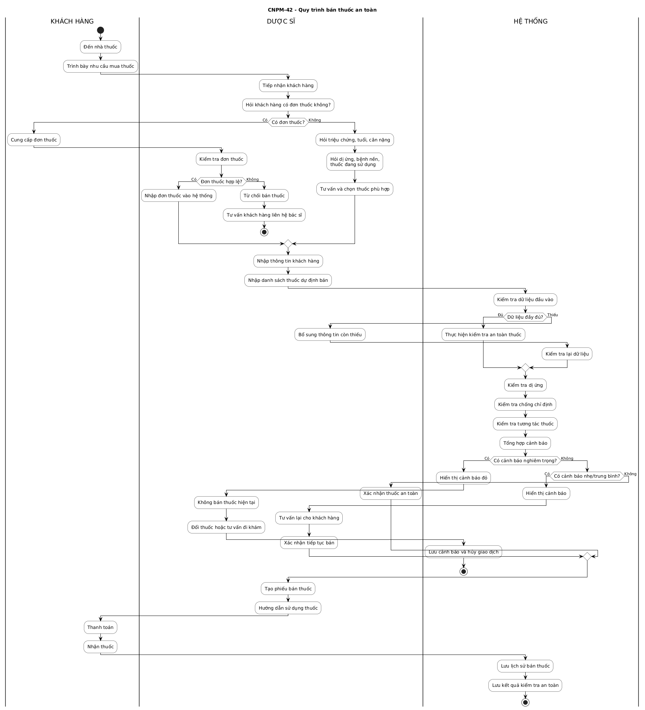

# CNPM-13 - Khảo sát quy trình bán thuốc tại nhà thuốc

## 1. Mục tiêu

Khảo sát và mô tả quy trình nghiệp vụ bán thuốc tại nhà thuốc, tập trung vào các bước tiếp nhận khách hàng, thu thập thông tin an toàn, kiểm tra rủi ro khi bán thuốc và tổng hợp quy trình bán thuốc an toàn.

Kết quả khảo sát là cơ sở để thiết kế giao diện, cơ sở dữ liệu và chức năng hỗ trợ dược sĩ ra quyết định bán thuốc an toàn.

---

# CNPM-39 - Xác định quy trình tiếp nhận khách hàng

## 1.1. Mục tiêu

Xác định các tình huống chính khi khách hàng đến nhà thuốc và cách dược sĩ tiếp nhận thông tin ban đầu.

## 1.2. Các luồng tiếp nhận khách hàng

### Luồng 1: Khách hàng có đơn thuốc

Khách hàng mang theo đơn thuốc do bác sĩ kê. Dược sĩ tiếp nhận đơn, kiểm tra các thông tin cơ bản như tên thuốc, hàm lượng, liều dùng, số lượng, ngày kê đơn và thông tin người kê đơn.

Nếu đơn thuốc hợp lệ, dược sĩ nhập thông tin đơn thuốc và danh sách thuốc vào hệ thống để thực hiện kiểm tra an toàn trước khi bán. Nếu đơn thuốc không hợp lệ, thiếu thông tin hoặc không rõ nội dung, dược sĩ tư vấn khách hàng liên hệ lại bác sĩ trước khi bán thuốc.

### Luồng 2: Khách hàng không có đơn thuốc

Khách hàng không có đơn thuốc và mua thuốc dựa trên triệu chứng tự khai. Dược sĩ cần hỏi thêm các thông tin như triệu chứng, thời gian mắc bệnh, độ tuổi, cân nặng, giới tính, tiền sử dị ứng thuốc, bệnh nền, thuốc đang sử dụng và tình trạng đặc biệt như mang thai hoặc cho con bú.

Sau khi thu thập thông tin, dược sĩ lựa chọn thuốc phù hợp để tư vấn và nhập thông tin vào hệ thống. Hệ thống sẽ kiểm tra an toàn trước khi dược sĩ xác nhận bán thuốc.

## 1.3. Use-case text: Tiếp nhận khách hàng mua thuốc

| Nội dung | Mô tả |
|---|---|
| Tên use-case | Tiếp nhận khách hàng mua thuốc |
| Actor chính | Dược sĩ |
| Actor phụ | Khách hàng |
| Mục tiêu | Thu thập thông tin khách hàng và nhu cầu mua thuốc để chuyển sang bước kiểm tra an toàn |
| Tiền điều kiện | Dược sĩ đã đăng nhập hệ thống |
| Hậu điều kiện | Thông tin khách hàng và danh sách thuốc dự định bán được ghi nhận |

## 1.4. Luồng chính

1. Khách hàng đến nhà thuốc và trình bày nhu cầu mua thuốc.
2. Dược sĩ tiếp nhận yêu cầu.
3. Dược sĩ xác định khách hàng có đơn thuốc hay không.
4. Nếu khách hàng có đơn thuốc, dược sĩ kiểm tra đơn thuốc và nhập thông tin thuốc vào hệ thống.
5. Nếu khách hàng không có đơn thuốc, dược sĩ hỏi triệu chứng và thông tin an toàn của khách hàng.
6. Dược sĩ nhập thông tin khách hàng vào hệ thống.
7. Dược sĩ nhập danh sách thuốc dự định bán.
8. Hệ thống chuyển sang bước kiểm tra an toàn thuốc.

## 1.5. Luồng thay thế

### Đơn thuốc không hợp lệ

1. Dược sĩ phát hiện đơn thuốc thiếu thông tin, không rõ liều dùng hoặc không rõ tên thuốc.
2. Dược sĩ thông báo cho khách hàng.
3. Dược sĩ tư vấn khách hàng liên hệ lại bác sĩ.
4. Giao dịch bán thuốc không được tiếp tục.

### Khách hàng không cung cấp đủ thông tin

1. Dược sĩ hỏi thông tin dị ứng, bệnh nền hoặc thuốc đang sử dụng.
2. Khách hàng không cung cấp đủ thông tin.
3. Hệ thống ghi nhận thiếu dữ liệu an toàn.
4. Dược sĩ cân nhắc tư vấn khách hàng đi khám hoặc chỉ bán thuốc khi đủ điều kiện an toàn.

## 1.6. Kết quả đầu ra

| Kết quả | Mô tả |
|---|---|
| Kịch bản tiếp nhận khách hàng | Mô tả hai luồng có đơn thuốc và không có đơn thuốc |
| Use-case tiếp nhận khách hàng | Ghi nhận actor, tiền điều kiện, hậu điều kiện và luồng xử lý |
| Dữ liệu đầu vào ban đầu | Làm cơ sở cho bước kiểm tra an toàn thuốc |

---

# CNPM-40 - Phân tích bước kiểm tra thông tin an toàn

## 2.1. Mục tiêu

Xác định các quy tắc an toàn cần được hệ thống tự động kiểm tra trước khi dược sĩ quyết định bán thuốc.

## 2.2. Các nhóm kiểm tra an toàn

| STT | Nhóm kiểm tra | Nội dung kiểm tra | Ví dụ | Mức cảnh báo |
|---:|---|---|---|---|
| 1 | Dị ứng thuốc | Kiểm tra khách hàng có dị ứng với hoạt chất hoặc nhóm thuốc của thuốc định bán hay không | Dị ứng Penicillin nhưng chọn Amoxicillin | Nghiêm trọng |
| 2 | Bệnh nền | Kiểm tra thuốc có chống chỉ định với bệnh nền của khách hàng hay không | Người cao huyết áp dùng thuốc cảm chứa Pseudoephedrine | Nghiêm trọng |
| 3 | Suy gan, suy thận | Kiểm tra thuốc có cần thận trọng với bệnh gan hoặc bệnh thận hay không | Thuốc thải trừ qua thận dùng cho bệnh nhân suy thận | Nghiêm trọng |
| 4 | Tương tác thuốc | Kiểm tra các thuốc trong giỏ hàng hoặc thuốc khách hàng đang dùng có tương tác bất lợi hay không | Tetracycline dùng cùng Canxi | Trung bình hoặc nghiêm trọng |
| 5 | Phụ nữ có thai | Kiểm tra thuốc có phù hợp với phụ nữ đang mang thai hay không | Thuốc không khuyến cáo trong thai kỳ | Nghiêm trọng |
| 6 | Đang cho con bú | Kiểm tra thuốc có ảnh hưởng đến trẻ bú mẹ hay không | Thuốc có thể bài tiết qua sữa mẹ | Trung bình hoặc nghiêm trọng |
| 7 | Trẻ em | Kiểm tra độ tuổi, cân nặng và liều dùng phù hợp với trẻ em | Thuốc không dùng cho trẻ dưới 2 tuổi | Nghiêm trọng |
| 8 | Người cao tuổi | Kiểm tra nguy cơ tác dụng phụ ở người cao tuổi | Thuốc gây buồn ngủ, chóng mặt | Trung bình |
| 9 | Trùng hoạt chất | Kiểm tra các thuốc có cùng hoạt chất gây nguy cơ quá liều | Hai thuốc cảm cùng chứa Paracetamol | Trung bình hoặc nghiêm trọng |
| 10 | Liều dùng | Kiểm tra liều dùng có vượt ngưỡng khuyến nghị hay không | Paracetamol vượt liều tối đa trong ngày | Nghiêm trọng |
| 11 | Thuốc kê đơn | Kiểm tra thuốc yêu cầu đơn nhưng khách hàng không có đơn | Kháng sinh bán không có đơn | Nghiêm trọng |
| 12 | Thiếu dữ liệu an toàn | Kiểm tra thiếu thông tin tuổi, dị ứng, bệnh nền hoặc thuốc đang dùng | Chưa khai báo tiền sử dị ứng | Nhẹ hoặc trung bình |

## 2.3. Phân loại cảnh báo

| Mức cảnh báo | Ý nghĩa | Cách xử lý |
|---|---|---|
| Nhẹ | Rủi ro thấp, chủ yếu là nhắc nhở dược sĩ | Cho phép tiếp tục bán, đồng thời hiển thị nhắc nhở |
| Trung bình | Có rủi ro cần dược sĩ xem xét trước khi bán | Yêu cầu dược sĩ tư vấn và xác nhận trước khi bán |
| Nghiêm trọng | Có nguy cơ ảnh hưởng trực tiếp đến an toàn khách hàng | Không khuyến nghị bán, cần đổi thuốc hoặc hỏi ý kiến bác sĩ |

## 2.4. Quy tắc quyết định

| Kết quả kiểm tra | Quyết định |
|---|---|
| Không có cảnh báo | Cho phép tạo phiếu bán thuốc |
| Có cảnh báo nhẹ | Cho phép bán nhưng hiển thị nhắc nhở |
| Có cảnh báo trung bình | Yêu cầu dược sĩ xác nhận đã tư vấn trước khi bán |
| Có cảnh báo nghiêm trọng | Không khuyến nghị bán thuốc hiện tại |

## 2.5. Sơ đồ kiểm tra an toàn thuốc

## 2.6. Kết quả đầu ra

| Kết quả | Mô tả |
|---|---|
| Danh sách quy tắc an toàn | Bao gồm dị ứng, bệnh nền, tương tác thuốc, đối tượng đặc biệt và quá liều |
| Phân loại cảnh báo | Nhẹ, trung bình, nghiêm trọng |
| Quy tắc quyết định | Xác định khi nào được bán, cần xác nhận hoặc không nên bán |

---

# CNPM-41 - Ghi nhận dữ liệu cần thu thập từ dược sĩ

## 3.1. Mục tiêu

Xác định các trường dữ liệu cần thu thập để hệ thống có đủ thông tin phục vụ việc kiểm tra an toàn thuốc.

## 3.2. Thông tin khách hàng

| STT | Trường dữ liệu | Kiểu dữ liệu | Bắt buộc | Mục đích |
|---:|---|---|---|---|
| 1 | Họ tên khách hàng | Text | Có | Lưu hồ sơ khách hàng |
| 2 | Số điện thoại | Text | Có | Tra cứu lịch sử mua thuốc |
| 3 | Giới tính | Select | Có | Hỗ trợ kiểm tra đối tượng đặc biệt |
| 4 | Ngày sinh hoặc tuổi | Date hoặc Number | Có | Kiểm tra trẻ em và người cao tuổi |
| 5 | Cân nặng | Number | Tùy trường hợp | Tính liều cho trẻ em hoặc thuốc theo cân nặng |
| 6 | Địa chỉ | Text | Không | Thông tin bổ sung |
| 7 | Ghi chú | Textarea | Không | Lưu thông tin đặc biệt |

## 3.3. Thông tin an toàn

| STT | Trường dữ liệu | Kiểu dữ liệu | Bắt buộc | Mục đích |
|---:|---|---|---|---|
| 1 | Tiền sử dị ứng thuốc | Multi-select hoặc Text | Có | Kiểm tra dị ứng thuốc |
| 2 | Hoạt chất từng dị ứng | Multi-select hoặc Text | Có nếu có dị ứng | So khớp với hoạt chất thuốc |
| 3 | Bệnh nền | Multi-select | Có | Kiểm tra chống chỉ định |
| 4 | Đang mang thai | Boolean | Có với khách hàng nữ | Kiểm tra thuốc không phù hợp thai kỳ |
| 5 | Đang cho con bú | Boolean | Có với khách hàng nữ | Kiểm tra thuốc ảnh hưởng trẻ bú mẹ |
| 6 | Thuốc đang sử dụng | Multi-select hoặc Text | Không hoặc có nếu khai báo | Kiểm tra tương tác thuốc |
| 7 | Ghi chú y tế | Textarea | Không | Lưu thông tin an toàn bổ sung |

## 3.4. Thông tin đơn thuốc

| STT | Trường dữ liệu | Kiểu dữ liệu | Bắt buộc | Mục đích |
|---:|---|---|---|---|
| 1 | Có đơn thuốc hay không | Boolean | Có | Xác định luồng xử lý |
| 2 | Mã đơn thuốc | Text | Không | Quản lý thông tin đơn thuốc |
| 3 | Ngày kê đơn | Date | Có nếu có đơn | Kiểm tra tính hợp lệ |
| 4 | Bác sĩ kê đơn | Text | Không | Lưu thông tin tham khảo |
| 5 | Ảnh đơn thuốc | File hoặc Image | Không | Lưu minh chứng đơn thuốc |

## 3.5. Thông tin thuốc dự định bán

| STT | Trường dữ liệu | Kiểu dữ liệu | Bắt buộc | Mục đích |
|---:|---|---|---|---|
| 1 | Tên thuốc | Select hoặc Search | Có | Chọn thuốc cần bán |
| 2 | Hoạt chất | Auto-fill | Có | Kiểm tra dị ứng và tương tác |
| 3 | Hàm lượng | Auto-fill | Có | Kiểm tra liều dùng |
| 4 | Dạng bào chế | Auto-fill | Có | Hiển thị thông tin thuốc |
| 5 | Số lượng | Number | Có | Lập phiếu bán thuốc |
| 6 | Liều dùng | Text | Có | Hướng dẫn sử dụng |
| 7 | Số lần dùng trong ngày | Number | Không | Hỗ trợ kiểm tra liều |
| 8 | Thời gian dùng | Text | Không | Tư vấn sử dụng |
| 9 | Ghi chú tư vấn | Textarea | Không | Lưu lời dặn của dược sĩ |

## 3.6. Dữ liệu kết quả kiểm tra an toàn

| STT | Trường dữ liệu | Kiểu dữ liệu | Mục đích |
|---:|---|---|---|
| 1 | Loại cảnh báo | Select | Phân loại dị ứng, chống chỉ định, tương tác hoặc quá liều |
| 2 | Mức độ cảnh báo | Select | Xác định nhẹ, trung bình hoặc nghiêm trọng |
| 3 | Nội dung cảnh báo | Textarea | Hiển thị lý do cảnh báo |
| 4 | Khuyến nghị xử lý | Textarea | Gợi ý đổi thuốc, hỏi bác sĩ hoặc tư vấn lại |
| 5 | Trạng thái xác nhận | Boolean | Ghi nhận dược sĩ đã xem cảnh báo |
| 6 | Quyết định cuối cùng | Select | Bán, không bán, đổi thuốc hoặc tư vấn đi khám |

## 3.7. Kết quả đầu ra

| Kết quả | Mô tả |
|---|---|
| Danh sách trường dữ liệu | Làm cơ sở thiết kế form bán thuốc |
| Dữ liệu an toàn | Làm đầu vào cho bộ kiểm tra dị ứng, chống chỉ định và tương tác thuốc |
| Dữ liệu giao dịch | Làm cơ sở tạo phiếu bán thuốc và lưu lịch sử |

---

# CNPM-42 - Tổng hợp quy trình nghiệp vụ bán thuốc an toàn

## 4.1. Mục tiêu

Tổng hợp quy trình nghiệp vụ bán thuốc an toàn từ bước tiếp nhận khách hàng đến khi hoàn tất giao dịch và lưu lịch sử bán thuốc.

## 4.2. Tác nhân tham gia

| Tác nhân | Vai trò |
|---|---|
| Khách hàng | Cung cấp nhu cầu mua thuốc, đơn thuốc và thông tin sức khỏe cần thiết |
| Dược sĩ | Tiếp nhận, tư vấn, nhập thông tin, xem cảnh báo và quyết định bán thuốc |
| Hệ thống | Lưu dữ liệu, kiểm tra an toàn, hiển thị cảnh báo và lưu lịch sử giao dịch |

## 4.3. Quy trình tổng quát

1. Khách hàng đến nhà thuốc và trình bày nhu cầu mua thuốc.
2. Dược sĩ tiếp nhận khách hàng.
3. Dược sĩ xác định khách hàng có đơn thuốc hay không.
4. Nếu có đơn thuốc, dược sĩ kiểm tra tính hợp lệ của đơn thuốc.
5. Nếu không có đơn thuốc, dược sĩ khai thác triệu chứng và thông tin an toàn.
6. Dược sĩ nhập thông tin khách hàng và danh sách thuốc dự định bán vào hệ thống.
7. Hệ thống kiểm tra dữ liệu đầu vào.
8. Hệ thống kiểm tra dị ứng, chống chỉ định, tương tác thuốc và đối tượng đặc biệt.
9. Hệ thống tổng hợp cảnh báo.
10. Nếu có cảnh báo nghiêm trọng, dược sĩ không bán thuốc hiện tại và tư vấn đổi thuốc hoặc đi khám.
11. Nếu có cảnh báo nhẹ hoặc trung bình, dược sĩ tư vấn lại và xác nhận trước khi bán.
12. Nếu không có cảnh báo, dược sĩ tạo phiếu bán thuốc.
13. Khách hàng thanh toán và nhận thuốc.
14. Hệ thống lưu lịch sử bán thuốc và kết quả kiểm tra an toàn.

## 4.4. Các điểm quyết định trong quy trình

| STT | Điểm quyết định | Nhánh xử lý |
|---:|---|---|
| 1 | Khách hàng có đơn thuốc không? | Có đơn thuốc hoặc không có đơn thuốc |
| 2 | Đơn thuốc có hợp lệ không? | Hợp lệ hoặc không hợp lệ |
| 3 | Dữ liệu đầu vào đã đầy đủ chưa? | Đủ hoặc thiếu |
| 4 | Có cảnh báo an toàn không? | Có hoặc không |
| 5 | Có cảnh báo nghiêm trọng không? | Có hoặc không |
| 6 | Dược sĩ có tiếp tục bán không? | Tiếp tục bán, đổi thuốc hoặc hủy giao dịch |

## 4.5. Kết quả đầu ra của quy trình

| Kết quả | Mô tả |
|---|---|
| Phiếu bán thuốc | Được tạo khi thuốc đủ điều kiện bán |
| Cảnh báo an toàn | Được tạo khi phát hiện rủi ro trong quá trình kiểm tra |
| Lịch sử bán thuốc | Lưu thông tin khách hàng, thuốc đã bán, dược sĩ bán và thời gian bán |
| Kết quả kiểm tra an toàn | Lưu mức cảnh báo, lý do cảnh báo và quyết định xử lý |
| Giao dịch bị hủy | Được ghi nhận khi thuốc không an toàn hoặc khách hàng không đủ điều kiện mua |

## 4.6. Sơ đồ quy trình bán thuốc an toàn

## 4.7. Kết quả đầu ra

| Kết quả | Mô tả |
|---|---|
| Quy trình nghiệp vụ tổng quát | Mô tả đầy đủ quá trình tiếp nhận, kiểm tra an toàn và bán thuốc |
| Các điểm quyết định | Làm rõ các nhánh nghiệp vụ quan trọng |
| Sơ đồ Activity Diagram | Minh họa trực quan quy trình bán thuốc an toàn |

---

# Kết luận

Nghiệp vụ bán thuốc an toàn cần kết hợp giữa thông tin khách hàng, thông tin thuốc và các quy tắc kiểm tra rủi ro. Hệ thống đóng vai trò hỗ trợ dược sĩ phát hiện các trường hợp có nguy cơ như dị ứng thuốc, chống chỉ định theo bệnh nền, tương tác thuốc, trùng hoạt chất hoặc sử dụng thuốc không phù hợp với đối tượng đặc biệt.

Kết quả khảo sát là cơ sở để xây dựng các chức năng chính của hệ thống gồm quản lý khách hàng, quản lý thuốc, tạo phiếu bán thuốc, kiểm tra an toàn và lưu lịch sử cảnh báo.
